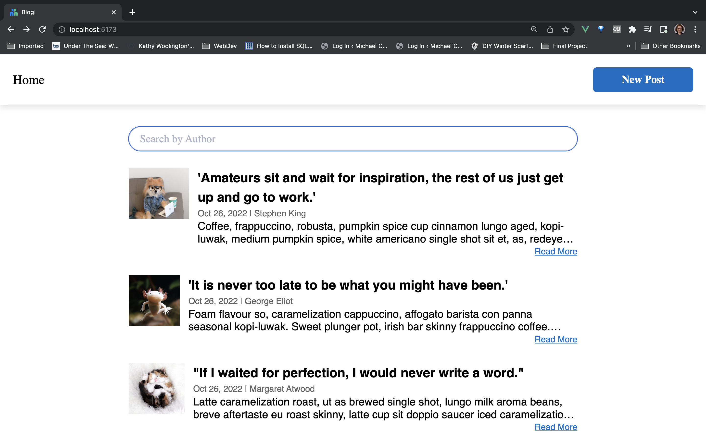
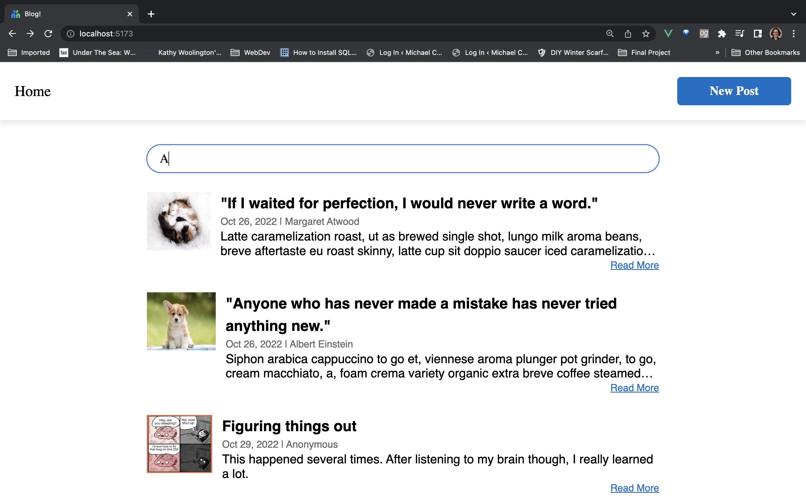
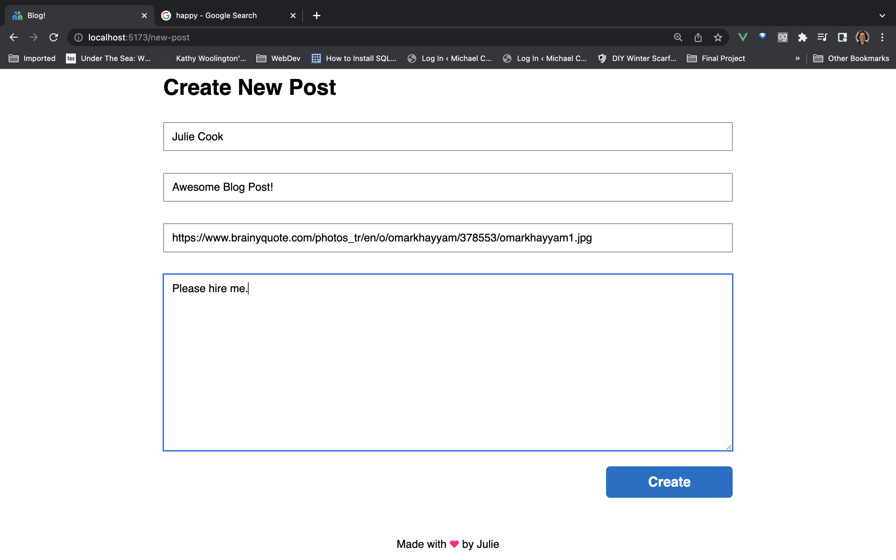
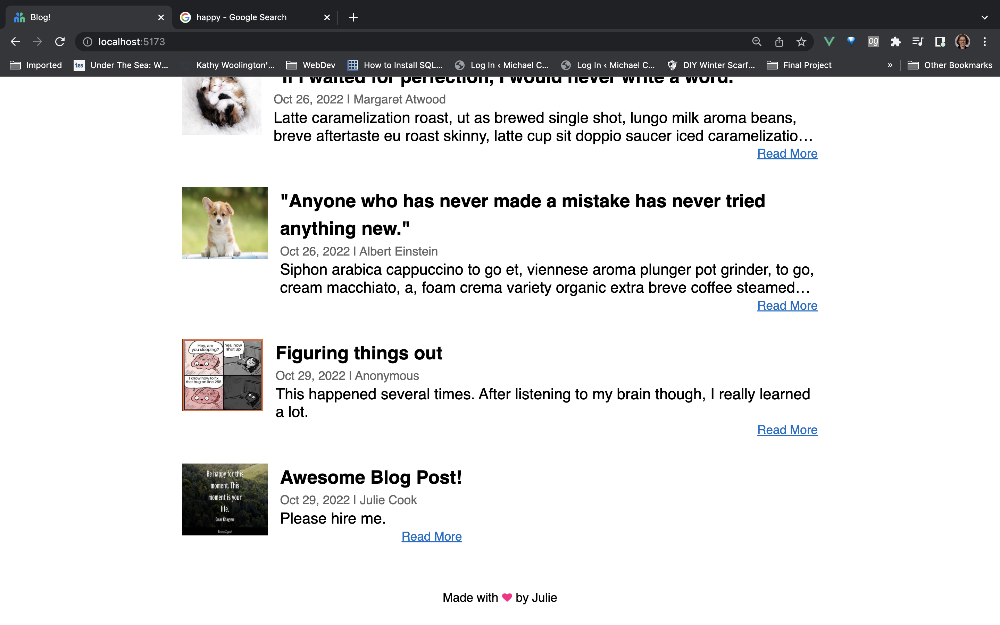
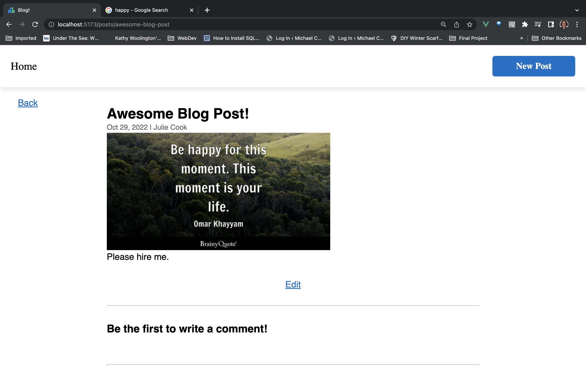
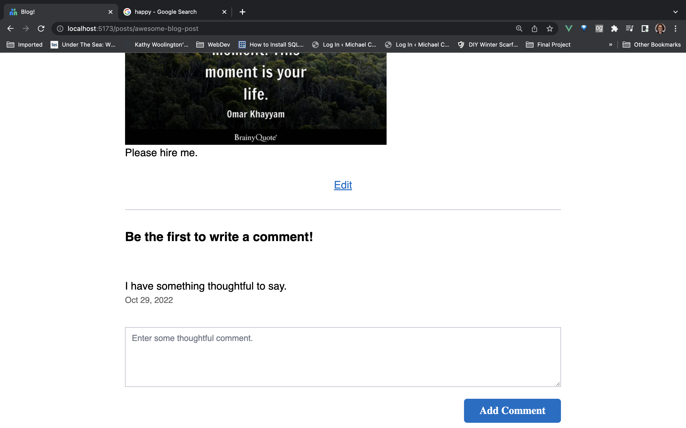
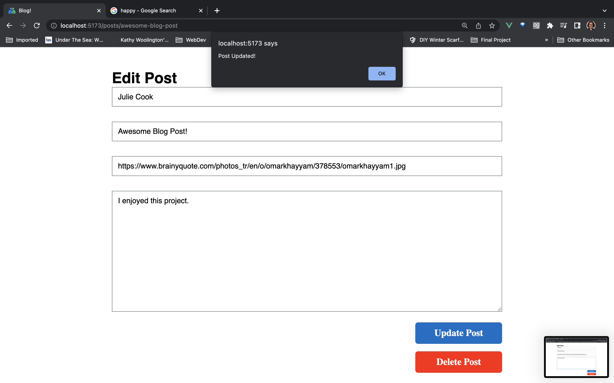
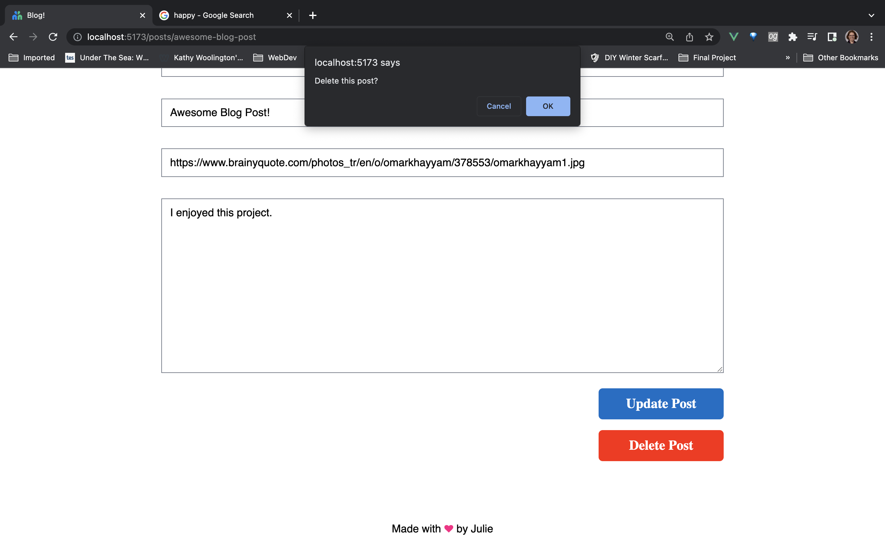

# homecare-Hub-Blog

A simple web app for a blog application with basic CRUD functionality

# Getting started

## Backend Installation

Please check the official laravel installation guide for server requirements before you start. [Official Documentation](https://laravel.com/docs/9.x/installation)

Clone the repository

    git clone git@github.com:Jules-C/homecare-Hub-Blog.git

Switch to the repo folder

    cd homecare-Hub-blog

Switch to the backend folder

    cd blog-backend

Install all the dependencies using composer

    composer install

Copy the example env file and make the required configuration changes in the .env file

    cp .env.example .env

<!-- Generate a new application key

    php artisan key:generate -->

<!-- Generate a new JWT authentication secret key

    php artisan jwt:generate -->

Run the database migrations (**Set the database connection in .env before migrating**)

    php artisan migrate

Start the local development server

    php artisan serve

You can now access the server at http://localhost:8000

**TL;DR command list**

    git clone git@github.com:Jules-C/homecare-Hub-Blog.git
    cd homecare-Hub-blog
    cd blog-backend
    composer install
    cp .env.example .env

**Make sure you set the correct database connection information before running the migrations** [Environment variables](#environment-variables)

    php artisan migrate
    php artisan serve

## Database seeding

**Populate the database with seed data. Hope you enjoy the dummy data.**

Run database migrations and seed the post tables

    php artisan db:seed

**_Note_** : It's recommended to have a clean database before seeding. You can refresh your migrations at any point to clean the database by running the following command

    php artisan migrate:refresh

## Environment variables

- `.env` - Environment variables can be set in this file

**_Note_** : You can quickly set the database information and other variables in this file and have the application fully working.

---

# Testing API

Run the laravel development server

    php artisan serve

The api can now be accessed at

    http://localhost:8000/api

Request headers

| **Required** | **Key**          | **Value**        |
| ------------ | ---------------- | ---------------- |
| Yes          | Content-Type     | application/json |
| Yes          | X-Requested-With | XMLHttpRequest   |
| Optional     | Authorization    | Token {JWT}      |

Refer the [api specification](#api-specification) for more info.

## Frontend Installation

Installing the frontend only has a few steps.

Switch to the blog-vue folder

    cd blog-vue

Install all the dependencies using composer

    npm install

Start the local development server

    npm run dev

Here's what you should (hopefully) see.

# Preview

Home Page:

Search Dynamically by Author Name:

Create new post:

New post saved:

Show a post to edit:

Add a comment:

Update the post:

Delete a post:

